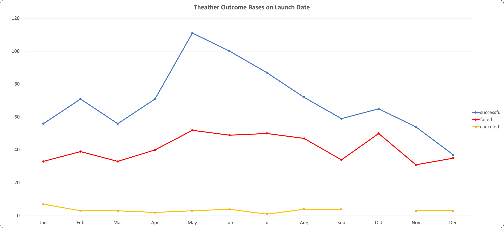
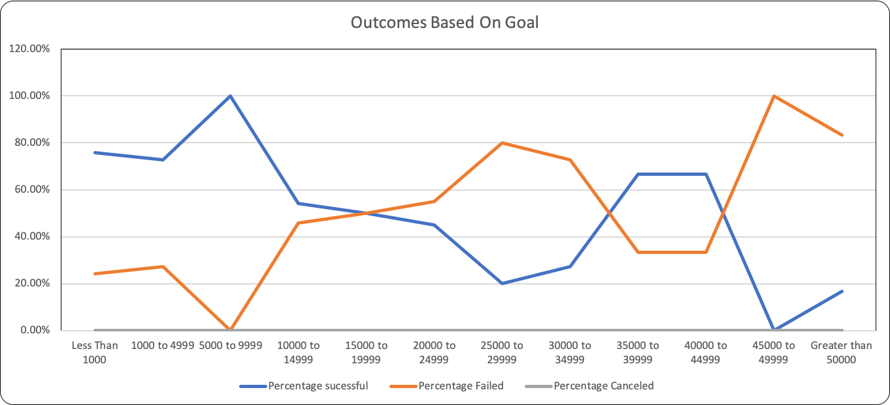

# KickStart My Chart
## Summary
* A homework assignment for UC Berkeley's Data Analytics Bootcamp
* Files present an exploratory analysis of Kickstarter data using Excel.
### Files

* The Kickstarter_Challengue.xlsx file is an Excel File that includes the Kickstarter data and the graphical and tabular portions of the analysis.

## Analysis and Challenges
* Using the Excel table provided, you will be modifying and analyzing the data of four thousand past Kickstarter projects as you attempt to uncover some of the market trends.
* Use conditional formatting to fill each cell in the state column with a different color, depending on whether the associated campaign was "successful," "failed," "cancelled," or is currently "live".
* Create a new column at column O called percent funded that uses a formula to uncover how much money a campaign made towards reaching its initial goal.
  * Use conditional formatting to fill each cell in the percent funded column using a three-color scale. The scale should start at 0 and be a dark shade of red, transitioning to green at 100, and then moving towards blue at 200.
* Create a new column at column P called average donation that uses a formula to uncover how much each backer for the project paid on average.
* Create two new columns, one called category at Q and another called sub-category at R, which use formulas to split the Category and Sub-Category column into two parts.
* Create a new sheet with a pivot table that will analyze your initial worksheet to count how many campaigns were "successful," "failed," "cancelled," or are currently "live" per category.
  * Create a stacked column pivot chart that can be filtered by country based on the table you have created.
* Create a new sheet with a pivot table that will analyze your initial sheet to count how many campaigns were "successful," "failed," "cancelled," or are currently "live" per sub-category.
  * Create a stacked column pivot chart that can be filtered by country and parent-category based on the table you have created.
  * The dates stored within the deadline and launched_at columns are using unix timestamps. Fortunately for us, there is a formula out there that can be used to convert these timestamps into a normal date.
* Create a new column named Date Created Conversion that will use this formula to convert the data contained within launched_at into Excel's Date format
* Create a new column named Date Ended Conversion that will use this formula to convert the data contained within deadline into Excel's Date format
* Create a new sheet with a pivot table with a column of state, rows of Date Created Conversion, values based on the count of state, and filters based on parent category and Years.
* Now create a pivot chart graph that visualizes this new table.
	 
	 
	 . 
	 

* Create a new sheet with 8 columns: Goal, Number Successful, Number Failed, Number Canceled, Total Projects, Percentage Successful, Percentage Failed, and Percentage Canceled
  * In the goal column, create twelve rows with the following headers...
  * Less Than 1000
  * 1000 to 4999
  * 5000 to 9999
  * 10000 to 14999
  * 15000 to 19999
  * 20000 to 24999
  * 25000 to 29999
  * 30000 to 34999
  * 35000 to 39999
  * 40000 to 44999
  * 45000 to 49999
  * Greater than or equal to 50000
  * Using the COUNTIFS() formula, count how many successful, failed, and canceled projects were created with goals within those ranges listed above. Populate the Number Successful, Number Failed, and Number Canceled columns with this data.
  * Add up each of the values in the Number Successful, Number Failed, and Number Canceled columns to populate the Total Projects column.
  * Then, using a mathematic formula, find the percentage of projects which were successful, failed, or were canceled per goal range.
  * Create a line chart which graphs the relationship between a goal's amount and its chances at success, failure, or cancellation.

  
  .  

  

  

  
## Report

1. What are two conclusions we can make about Kickstarter campaigns given the provided data?
2. What are some of the limitations of this dataset?
3. What are some other possible tables/graphs that we could create?

**What are two conclusions we can make about Kickstarter campaigns given the    provided data?**
   
  *  Theater is by far the most prevalent category, which leads there to be a peak in Kickstarters from May to July. However, if the Theater category is removed, January has the highest number of Kickstarters.
   
  *  Later years tend to have many more Kickstarter campaigns than earlier years do in this sample. This may be partly due to the financial crisis. This may also partly be due to the fact that Kickstarter is a relatively new company (founded in 2009).
  
**What are some of the limitations of this dataset?**

There is evidence that this sample does not fully represent the population of Kickstarter campaigns. For example, the assignment’s instructions mention that only a third of Kickstarter campaigns make it through funding with positive outcomes, but this database shows that more than half of the programs selected are successful. Additionally, this sample includes quite a few Theater Kickstarter campaigns, but Kickstarter’s website does not identify Theater as the most common category.

There are not any metrics that describe the success of each industry/category/sub-category as a whole during the covered time period. It would be helpful to have data that shows whether or not each industry/category/subcategory does well or poorly during the relevant time periods. This might help us account for external factors while analyzing the data.  

  
**What are some other possible tables/graphs that we could create?**

There are several tables/graphs we could create. Below is a list of some additional ideas for data displays:
1. Graphs for all the metrics covered with and without “plays” (the most popular category).
2.	Tables showing the most successful categories/subcategories versus the most unsuccessful categories/subcategories and detailed data into each category/subcategory’s level of success. Some possible metrics include (1) success rate per category/subcategory, (2) median, max, and min funding goal/target per category/subcategory, (3) median, max, and min of average donation per category/subcategory, (4) median, max, and min of percent funded per category/subcategory, (5) median, max, and min length of Kickstarter campaign timelines per category/subcategory etc.
3.	Displays showing the average timelines (how much time companies/organizations have to complete the Kickstarter campaigns) for the most successful and least successful types of programs (perhaps having more time to achieve funding targets would lead to greater rates of success).
4.	Displays and tables that exclude significant funding goal outliers.
5.	Graphs and displays that break up each category into its specific subcategories to uncover what makes different types of organizations successful. Several categories are relatively broad so it might be that some subcategories within each category have significantly different funding goals, average donations, lengths of Kickstarter timelines, and take place during different periods of time (years and seasons). Breaking up each category into subcategories would help us better understand the data.
